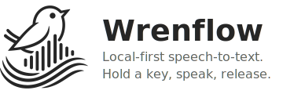

<p align="center">
  <picture>
    <source media="(prefers-color-scheme: dark)" srcset="Resources/readme-header-dark.svg">
    <source media="(prefers-color-scheme: light)" srcset="Resources/readme-header-light.svg">
    
  </picture>
</p>

<p align="center">
  <a href="https://github.com/IlyaGulya/wrenflow/releases/latest/download/Wrenflow.dmg"><b>Download for macOS</b></a><br>
  <sub>macOS 14+ · Apple Silicon</sub>
</p>

---

Wrenflow is a free, open-source dictation app. Hold a key, speak, release — text appears at your cursor. All transcription runs locally on your Mac.

> **Platform support:** macOS only for now. The core is written in Rust — other platforms are planned.

## How it works

1. Hold **Fn** (or your configured hotkey) to record
2. Release to transcribe
3. Text is pasted at your cursor

Transcription typically completes in under a second. The model downloads automatically on first launch (~600 MB).

## Features

- **On-device transcription** — [Parakeet TDT 0.6B](https://huggingface.co/nvidia/parakeet-tdt-0.6b-v2) via ONNX Runtime, no internet required
- **Model prewarm** — first transcription is as fast as subsequent ones
- **Configurable hotkey** — Fn, Right Option, or F5
- **Transcription history** — searchable log with audio recordings saved as OGG/Opus
- **Menu bar app** — lives in the menu bar, no dock icon

## Architecture

Flutter (Dart) for UI, Rust for core logic, connected via [Rinf](https://github.com/aspect-build/aspect-frameworks/tree/main/packages/rinf).

```
core/
  wrenflow-domain/    Pure types and business logic (no IO)
  wrenflow-core/      Infrastructure: audio capture, transcription,
                      HTTP clients, SQLite history store
native/hub/           Rinf bridge — actors for audio, pipeline,
                      hotkeys, model management, history
lib/                  Flutter UI (Riverpod state management)
macos/Runner/         macOS platform code (overlay, permissions, tray)
```

**Audio capture** uses [cpal](https://github.com/RustAudio/cpal) with CoreAudio.
**Transcription** uses [parakeet-rs](https://github.com/istupakov/parakeet-rs) with ONNX Runtime.
**History** is stored in SQLite via [rusqlite](https://github.com/rusqlite/rusqlite).
**Recordings** saved as OGG/Opus (~15 KB per recording).

## Build from source

Requires: [mise](https://mise.jdx.dev/) (manages all other tools automatically).

```bash
mise install       # Install Rust, Flutter, Ruby, CocoaPods, XcodeGen, etc.
mise run build     # Debug .app bundle
mise run run       # Build + launch (via open, for microphone access)
mise run release   # Release build (signed, hardened runtime)
```

Other useful commands:

```bash
mise run lint          # Clippy + Flutter analyze + workflow lints
mise run test          # Flutter tests
mise run test-rust     # Rust tests
mise run check-rust    # Cargo check
mise run icons         # Regenerate app icons from SVG sources
mise run pin-actions   # Pin GitHub Actions to full-length SHAs
mise run logs          # Tail app logs
mise run clean         # Remove build artifacts
```

## Contributing

Commits follow [Conventional Commits](https://www.conventionalcommits.org/). Pre-commit hooks validate commits and run linters automatically.

```bash
git config core.hooksPath .githooks
```

Releases are managed by [release-please](https://github.com/googleapis/release-please) — push `feat:` or `fix:` commits to `main` and a release PR will be created automatically.

## Acknowledgments

Thanks to [Zach Latta](https://github.com/zachlatta) and [FreeFlow](https://github.com/zachlatta/freeflow) — the project that started it all.

## License

MIT
