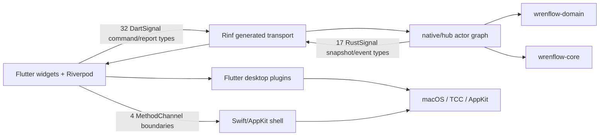
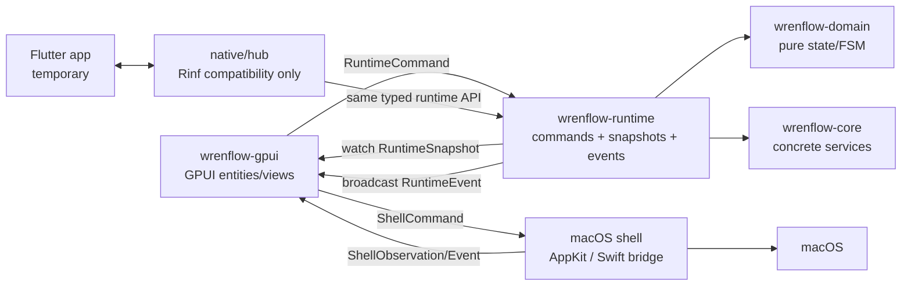

# ADR: GPUI target architecture and Rinf-free runtime extraction

Status: implemented. References to Flutter, Dart, Rinf and `native/hub` below
describe the migration baseline and strangler sequence, not the current
production architecture.

- Status: accepted on 2026-08-09 after `wrenflow-duh.1`
- Epic: `wrenflow-duh`
- Primary design task: `wrenflow-duh.2`
- Runtime extraction task: `wrenflow-duh.3`
- Audit baseline: working tree at `e5aa884` on 2026-08-09; the tree contained
  pre-existing uncommitted work, so this document describes the code as read,
  not only committed `HEAD`

## Decision summary

Wrenflow should become one Rust application with four explicit layers:

1. `wrenflow-domain` keeps pure product values and state machines.
2. `wrenflow-core` keeps concrete, UI-independent services such as audio,
   transcription, model download, persistence, encoding, hotkey and paste.
3. A new `wrenflow-runtime` crate owns the live product graph and exposes a
   typed `RuntimeCommand` input, watchable snapshots, and ephemeral
   `RuntimeEvent`s. It must not depend on Rinf, Flutter, GPUI, AppKit, or Swift.
4. A new GPUI application target projects runtime state into GPUI entities and
   delegates macOS-only work to a narrow AppKit shell.

During migration, `native/hub` remains a compatibility adapter. It converts
Rinf Dart signals into `RuntimeCommand`s and converts runtime snapshots/events
back into Rust signals. Flutter remains runnable until the GPUI path has parity.
No product actor should continue to receive or send a Rinf signal directly.

The initial macOS shell should retain the existing native overlay behavior and
reimplement its bridge without Flutter. Tray, activation policy, TCC permission
queries/prompts, launch-at-login, window ordering, app termination, and opening
System Settings belong to the shell. GPUI owns the settings/onboarding/history
content, not these OS integrations.

## Why this boundary

The current code has already moved most durable state and the transcription FSM
to Rust, but the orchestration crate is also the Rinf transport. Replacing
Flutter directly while keeping that shape would merely substitute GPUI calls
for Rinf calls across every actor and make the runtime untestable without a UI.
The compatibility-adapter step separates the two migrations:

- `.3` changes transport and ownership while Flutter still proves product
  behavior;
- `.4`/`.5` establish the GPUI/AppKit application shell;
- `.6` ports presentation against a stable Rust API;
- `.7` deletes the compatibility adapter, generated Dart and Flutter packaging.

## Current architecture, verified in code



### Crate responsibilities today

| Area | Current source | What it actually owns |
|---|---|---|
| Pure values/FSM | `core/wrenflow-domain` | `AppConfig`, pipeline state machine, history/metrics/model/audio value types |
| Concrete services | `core/wrenflow-core` | CPAL capture, ONNX transcription, model download, SQLite/config stores, OGG/Opus encoding |
| Runtime composition | `native/hub/src/actors/mod.rs` | `RuntimeGraph`, task startup, hotkey/audio/transcription/paste orchestration, shared engine handles |
| Transport DTOs | `native/hub/src/signals/mod.rs` | Product DTOs mixed with Rinf derives and all command/event declarations |
| Presentation projection | `lib/providers`, `lib/shell/*_presentation.dart` | Riverpod mirrors, derived settings/wizard/tray/overlay state |
| Desktop orchestration | `lib/shell` | plugin and platform-channel invocation, polling, tray/window/overlay side effects |
| Native macOS | `macos/Runner` | TCC, launch-at-login, activation policy and screen-saver-level panels |

### Current live state owners

| State | Current canonical owner | Secondary/mirror owner | Observation |
|---|---|---|---|
| Persisted settings | `settings_actor::SettingsRuntime` | optimistic `SettingsNotifier` | Rust persists every mutation through `ConfigStore` |
| App session/onboarding | `app_session_actor` | `AppLifecycleNotifier` | Rust combines settings and permission watches |
| Local model catalog/status/active engine | `model_actor` | several derived Riverpod providers | `Arc<Mutex<Option<LocalTranscriptionEngine>>>` is shared with pipeline |
| Pipeline | domain `PipelineEngine` inside hub `PipelineActor` | stream providers and shell presentations | hotkey loop, audio, ASR, recording save and paste are still assembled in `actors/mod.rs` |
| History storage | blocking `HistoryActor` | `HistoryNotifier` list | UI performs optimistic delete/clear separately |
| Audio device inventory | `audio_devices_actor` | `audioDevicesSnapshotProvider` | refresh is triggered by snapshot request |
| Runtime capabilities | `runtime_capabilities_actor` | Riverpod stream | computed by Rust probes |
| Permissions | AppKit is external truth; Dart polls it | Rust mirror with `watch`, then Dart mirror | a three-hop feedback loop feeds app-session state |
| Launch at login | `SMAppService` is external truth; Dart invokes it | Rust mirror, then Dart mirror | another three-hop feedback loop |
| Updates | Dart `GitHubUpdateSource` performs network check | Rust mirror, then Dart mirror | the so-called Rust owner only stores Dart reports |
| Shell capabilities | Flutter adapters/plugins | Rust mirror, then Dart mirror | transport churn without adding authority |
| Main window/navigation | Riverpod | window plugins + AppDelegate activation policy | legitimately UI-local state |
| Tray/menu/overlay projection | Riverpod | plugin/AppKit objects | derived from runtime + UI state |

### Rinf surface

`native/hub/src/signals/mod.rs` currently declares 32 `DartSignal` types and 17
`RustSignal` types.

| Group | Dart to Rust | Rust to Dart |
|---|---:|---:|
| Pipeline | 3 | 5 |
| Settings | 8 | 1 |
| Audio level/devices | 1 | 2 |
| History | 3 | 2 |
| Models | 3 | 1 |
| Runtime capabilities | 1 | 1 |
| Permissions | 2 | 1 |
| App session | 5 | 1 |
| Updates | 2 | 1 |
| Shell capabilities | 2 | 1 |
| Launch at login | 2 | 1 |
| **Total** | **32** | **17** |

Verified transport debt:

- `StartRecording` and `StopRecording` are declared but no hub actor receives
  them. Production recording is driven only by `HotkeyActor`.
- `BootstrapAppSession` is declared but not received. The current
  `AppSessionRuntimeState::new` sets `bootstrapped` to `true` immediately and
  uses the settings watch instead.
- `PlaySound` and `PasteComplete` are sent by Rust but have no non-generated
  Dart consumer in the current tree.
- Snapshot consumers must subscribe first and then send a separate request.
  The `rustSnapshotStream` helper encodes this handshake repeatedly.
- Commands carry no acknowledgement, revision, or typed failure. Settings,
  history and some shell actions therefore use optimistic local projection.
- `SetTranscriptAction` encodes `paste`/`display_only` as a string and stores it
  in a process-global `AtomicBool`.
- Product values such as pipeline/model/session state live in the transport
  module because `SignalPiece` derives are mixed into their definitions.

These are migration inventory items, not all necessarily user-visible bugs.
Parity tests should explicitly decide whether the unused surfaces are deleted
or restored.

### macOS shell boundaries today

The application has four direct Flutter method-channel boundaries:

| Channel | Native implementation | Required target boundary |
|---|---|---|
| `dev.gulya.wrenflow/permissions` | `PermissionHandler.swift` | check/request microphone and accessibility; open the matching System Settings panes |
| `dev.gulya.wrenflow/launch_at_login` | `LaunchAtLoginHandler.swift` | `SMAppService.mainApp` query/register/unregister |
| `dev.gulya.wrenflow/overlay` | `OverlayHandler.swift` | recording/transcribing panels, audio level, error toast and action callback |
| `dev.gulya.wrenflow/app_policy` | `AppDelegate.swift` | `.accessory`/`.regular` activation policy and foreground activation |

`OverlayHandler` is not a Flutter view. It creates borderless,
non-activating `NSPanel`s at `.screenSaver`, joins all Spaces and hosts SwiftUI.
That behavior is more specific than an ordinary GPUI window and should stay in
the AppKit shell for the first release.

Tray and main-window behavior currently come from `tray_manager`,
`window_manager`, and `macos_window_utils`; these must become AppKit shell code
because GPUI does not replace system status-item behavior or every AppKit
lifecycle operation.

## Target architecture



### Accepted workspace layout

```text
core/
  wrenflow-domain/           # pure values, policies and state machines
  wrenflow-core/             # concrete UI-independent implementations
  wrenflow-runtime/          # new live application graph and public API
native/
  hub/                       # temporary Rinf adapter; no product ownership
  wrenflow-gpui/             # GPUI binary/application target
  wrenflow-gpui/macos/       # Swift/AppKit shell compiled behind a C ABI
```

Rules:

- `wrenflow-domain` has no dependency on async runtimes, UI or OS frameworks.
- `wrenflow-core` may depend on Tokio and platform libraries but not on Rinf,
  Flutter, GPUI or Swift bridge types.
- `wrenflow-runtime` may depend on domain/core/Tokio. Its public API contains
  only Rust product types.
- `native/hub` depends on `wrenflow-runtime` and `rinf`; nothing depends on
  `native/hub`.
- `wrenflow-gpui` depends on GPUI, runtime and its private Swift/AppKit shell.
  Runtime never depends on GPUI or shell ABI types.
- AppKit calls that require the main thread are initiated from the GPUI app
  thread. Tokio workers never directly manipulate windows, `NSStatusItem`,
  `NSApplication`, permission prompts or `SMAppService`.

## Runtime API

The API should separate durable/current state from edge-triggered effects.
Snapshots are watch channels: a new subscriber immediately has the current
value, so `Request*Snapshot` commands disappear. Events are broadcast with a
small bounded capacity and sequence number; they are never treated as state.

Illustrative public API:

```rust
#[derive(Clone)]
pub struct RuntimeHandle {
    commands: tokio::sync::mpsc::Sender<RuntimeRequest>,
    snapshot: tokio::sync::watch::Receiver<RuntimeSnapshot>,
    audio_level: tokio::sync::watch::Receiver<f32>,
    events: tokio::sync::broadcast::Sender<RuntimeEventEnvelope>,
}

pub struct RuntimeRequest {
    pub command: RuntimeCommand,
    pub completion: Option<tokio::sync::oneshot::Sender<Result<CommandOutcome, RuntimeError>>>,
}

pub enum RuntimeCommand {
    UpdateSettings(SettingsPatch),
    ActivateSelectedModel,
    CancelModelOperation,
    ReloadAudioDevices,
    DeleteHistoryEntry { id: HistoryEntryId },
    ClearHistory,
    AdvanceOnboarding,
    RetreatOnboarding,
    SetTranscriptDisposition(TranscriptDisposition),
    ReportPermissions(PermissionsSnapshot),
    ReportLaunchAtLogin(LaunchAtLoginSnapshot),
    ReportUpdateStatus(UpdateStatus),
    ReportShellCapabilities(ShellCapabilities),
    Shutdown,
}

pub enum SettingsPatch {
    SelectedLocalModel(ModelId),
    Hotkey(HotkeyBinding),
    Microphone(AudioDeviceId),
    SoundEnabled(bool),
    CustomVocabulary(String),
    MinimumRecordingDuration(std::time::Duration),
    HasCompletedSetup(bool),
}

pub enum TranscriptDisposition {
    Paste,
    DisplayOnly,
}

pub struct RuntimeSnapshot {
    pub revision: u64,
    pub settings: SettingsSnapshot,
    pub session: AppSessionState,
    pub pipeline: PipelineState,
    pub models: LocalModelsSnapshot,
    pub permissions: PermissionsSnapshot,
    pub history: HistorySnapshot,
    pub audio_devices: AudioDevicesSnapshot,
    pub runtime_capabilities: RuntimeCapabilities,
    pub shell: ShellFacts,
}

pub enum RuntimeEvent {
    PlaySound(PipelineSound),
    TranscriptReady { transcript: String },
    PipelineError { message: String, action: Option<ErrorAction> },
    PasteCompleted,
    HistoryEntryAdded(HistoryEntry),
    QuitRequested,
}
```

Exact type names can change, but the following semantics are required:

- `send(command).await` reports queue failure; commands that affect persisted
  state, OS state or destructive history operations support an optional
  completion result.
- one supervisor assigns a monotonically increasing snapshot revision;
  compatibility adapters can ignore it, GPUI uses it for diagnostics/tests.
- a bounded `mpsc` command channel supplies backpressure. High-rate audio level
  uses a dedicated `watch`, not the full snapshot or broadcast stream.
- downloads publish throttled model-state changes; the current 50 ms throttle
  remains unless profiling justifies a different value.
- snapshot publication happens after canonical state changes. UI-local
  optimistic state is allowed for text-field drafts, not canonical settings.
- lagged event subscribers log/measure `broadcast::RecvError::Lagged`; durable
  state is recovered from the latest snapshot.
- shutdown is typed and cooperative: stop hotkey/audio, cancel model work,
  flush stores, publish `ShuttingDown`, join owned tasks, then let the shell
  terminate the process.

### Supervisor and subsystem ownership

`AppRuntime::start(RuntimeDependencies) -> (RuntimeHandle, RuntimeJoinHandle)`
creates all channels and starts one supervisor. The supervisor owns child task
handles and cancellation. Subsystems may retain focused channels/watches but
must not expose their mutexes to the UI.

| Subsystem | Canonical state | Inputs | Output |
|---|---|---|---|
| Settings | `AppConfig` + persistence result | `SettingsPatch`, internal last-active-model update | snapshot revision |
| Session | onboarding/permission-recovery FSM | settings watch, permissions watch, navigation commands | session snapshot |
| Models | selected/active/status map + engine lease | settings watch, activate/cancel | model snapshot, readiness watch |
| Pipeline | `PipelineEngine`, recording/transcription job | hotkey events, config/model/device watches, timers | pipeline snapshot + effect events |
| History | SQLite connection on dedicated thread | insert/delete/clear/load | history snapshot |
| Devices | device inventory + effective selection | reload, config watch | device snapshot |
| Capabilities | backend probes + shell observations | startup/refresh reports | capabilities snapshot |

The transcription engine must be behind a runtime-owned service interface or
actor command, not an `Arc<Mutex<Option<_>>>` handed to unrelated actors. At
minimum introduce `TranscriptionEngineSlot` with typed `status()` and
`transcribe()` methods; preferably serialize model activation and transcription
through one model service so an engine cannot be replaced while it is in use.

## GPUI ownership and entity boundaries

GPUI state should be a projection, not a second product runtime.

Recommended entities:

- `AppModel`: owns the `RuntimeHandle`, latest immutable snapshot, event
  subscription tasks and shell facade. It calls `cx.notify()` once per accepted
  snapshot revision.
- `NavigationModel`: owns UI-only surface/tab/modal selection and window
  visibility intent.
- `WizardModel`: owns unsaved form draft and validation only. Current step and
  completion remain runtime state.
- `SettingsModel`: owns temporary field edits/focus; committed values come from
  the runtime snapshot.
- one root window view switches between onboarding, recovery and settings and
  renders the selected settings page.

Do not create an entity for every snapshot slice or history row initially. A
single `AppModel` plus local screen models gives clear invalidation and avoids a
Riverpod-like provider graph recreated by hand. Extract additional entities only
when independent lifecycle or update frequency is proven.

Window rules:

- the main GPUI window is the settings/onboarding window;
- runtime session + `NavigationModel` derive a `MainWindowPresentation`-like
  value;
- an AppKit shell applies activation policy before show/hide and focuses the
  window on the main thread;
- closing settings hides it and returns to accessory mode; it does not stop the
  runtime;
- first-frame visibility remains gated to avoid startup flash;
- tray actions dispatch typed UI navigation or runtime commands;
- recording and error overlays remain native panels in the first migration.

### Tokio and GPUI integration

- GPUI/AppKit owns the process main thread via `App::new().run(...)`.
- Construct a Tokio multi-thread runtime explicitly; do not use
  `#[tokio::main]` on the GPUI entry point.
- Keep the Tokio runtime owner alive for the complete GPUI app lifetime.
- Start `AppRuntime` on that Tokio runtime. CPAL/raw-input threads and blocking
  SQLite/ASR jobs remain outside the GPUI executor.
- A GPUI background task awaits cloned `watch::Receiver::changed()` and
  `broadcast::Receiver::recv()` futures and upgrades a weak `AppModel` before
  `cx.update(...)` on the GPUI executor.
- Never hold a `std::sync::MutexGuard` across `.await` or an `Entity::update`.
- Coalesce snapshot changes by revision when a download or permission poll
  produces bursts. Audio levels update a focused entity/watch at a capped rate.
- On quit, issue `RuntimeCommand::Shutdown`, await a bounded graceful-shutdown
  deadline, then destroy tray/panels and terminate. Forced process exit is only
  a timeout fallback.

## macOS shell contract

The shell API is deliberately separate from `RuntimeCommand`, because many
operations must execute on the application main thread and external OS state is
not owned by the runtime.

```rust
pub enum ShellCommand {
    SetActivationPolicy(ActivationPolicy),
    ShowMainWindow(WindowPresentation),
    HideMainWindow,
    SetTray(TrayPresentation),
    ShowOverlay(OverlayPresentation),
    HideOverlay,
    ShowError(ErrorPresentation),
    RequestMicrophonePermission,
    RequestAccessibilityPermission,
    OpenPermissionSettings(PermissionKind),
    SetLaunchAtLogin(bool),
    OpenUrl(url::Url),
    Quit,
}

pub enum ShellObservation {
    PermissionsChanged(PermissionsSnapshot),
    LaunchAtLoginChanged(LaunchAtLoginSnapshot),
    OverlayAction(ErrorAction),
    TrayAction(TrayAction),
    MainWindowClosed,
}
```

Accepted implementation after `.1`:

1. Use a private Swift/AppKit shell compiled by `native/wrenflow-gpui/build.rs`
   and called through a versioned C ABI. The spike proved Swift object linking,
   Swift runtime search paths, `NSStatusItem`, activation policy, TCC entry
   points, Developer ID signing and LaunchServices startup without an Xcode host.
2. Extract the existing SwiftUI/AppKit panel controller into the GPUI shell
   without changing its `screenSaver`, all-Spaces, non-activating and error-action
   semantics. Keep the Flutter `MethodChannel` implementation untouched as the
   rollback path until `.7`; do not use MethodChannel from the GPUI process.
3. Do not add a `wrenflow-macos` Rust crate or duplicate AppKit ownership through
   `objc2` in the first migration. Reconsider that only after Flutter deletion if
   the Swift ABI becomes a maintenance cost.
4. Package the GPUI app with the proven Cargo + bundle-script path. XcodeGen
   remains only for the parallel Flutter target. If extracted SwiftUI sources
   cannot link through the proven Swift-object path, `.4` may package them as a
   signed private dylib, but must not introduce a second application event loop.

Permissions should be observed by the shell and reported once per change or
poll tick to runtime. GPUI reads only the runtime permission snapshot for
presentation. This removes the current AppKit -> Dart -> Rust -> Dart loop.

Updates should move into Rust runtime (`reqwest` is already a workspace
dependency) unless the release spike identifies a platform updater that must be
shell-owned. Shell only opens a release/download URL or invokes the selected
native updater.

## Component-library decision

Use and exact-pin the published Apache-2.0 pair `gpui = 0.2.2` and
`gpui-component = 0.5.1` (plus `gpui-component-assets = 0.5.1`) for application
infrastructure and standard controls. The companion `spikes/gpui-controls`
target proved text input, select, switches, sidebar and virtualized lists at
those versions. Do not import Zed's GPL `crates/ui` into this MIT project.

Enable GPUI `runtime_shaders` for the initial target: the signed `.1` bundle
launched successfully with it, while Xcode 26's optional command-line Metal
compiler was not reproducibly present. A later dedicated dependency/build change
may install the Metal Toolchain in CI and switch to an embedded metallib. Keep
Wrenflow tokens and composed components in its own app crate so the third-party
layer remains replaceable. `gpui-component`'s mouse-only `Switch` must be wrapped
or replaced with keyboard, focus and accessibility behavior in `.5`.

## Strangler migration sequence

### Phase A: establish transport-neutral API

1. Add `core/wrenflow-runtime` with `api`, `state`, `error`, `supervisor` and
   subsystem modules.
2. Move product DTOs out of `native/hub/src/signals/mod.rs`. Domain values live
   in `wrenflow-domain`; aggregate/runtime-only snapshots live in
   `wrenflow-runtime`.
3. Give runtime types `Clone`, `Debug`, `PartialEq` and `serde` only where
   persistence/diagnostics need it. Do not derive `SignalPiece` outside hub.
4. Add unit tests for command mapping, initial snapshot availability,
   monotonic revisions, lag recovery and graceful shutdown.
5. In hub, define thin Rinf wire structs and explicit `From` conversions.

Exit criterion: runtime public source contains no `rinf`, `gpui`, `Flutter` or
AppKit imports and can be tested as an ordinary Rust library.

### Phase B: extract low-risk snapshot subsystems

1. Extract settings state/store and publish it through runtime watch channels.
2. Extract permissions/session watches. Preserve the three-sample lost
   permission threshold and onboarding invariants from
   `docs/runtime-invariants.md`.
3. Replace launch-at-login, updates and shell-capability mirror actors with
   typed report commands into runtime state.
4. Extract runtime capability probing and audio-device inventory.
5. Make hub adapter tasks the only place calling
   `get_dart_signal_receiver`/`send_signal_to_dart`.

Exit criterion: Flutter still behaves identically, but all canonical snapshots
come from `RuntimeHandle`; no extracted subsystem imports Rinf.

### Phase C: extract storage and model lifecycle

1. Move history thread ownership into runtime and publish a complete
   `HistorySnapshot`; delete optimistic canonical mutations in new clients.
2. Move model catalog/runtime state and download task lifecycle into runtime.
3. Replace shared `AtomicBool` cancellation with a per-operation cancellation
   token/generation, preserving cancel-and-queue semantics for model switches.
4. Replace the shared transcription-engine mutex with the runtime service
   boundary. Preserve startup model resolution and prewarm.

Exit criterion: download/activate/cancel/switch and history commands have typed
results, can be integration-tested without Rinf, and Flutter adapter parity
tests pass.

### Phase D: extract hotkey/audio/transcription pipeline

1. Move `RuntimeGraph`, hotkey start/update, audio capture and pipeline select
   loop into runtime supervisor modules.
2. Replace `SignalListener` with an internal runtime publisher that updates
   snapshot state and emits effects.
3. Move recording persistence and `recordings_dir` into a recording service.
   Keep OGG encoding parallel with in-memory transcription.
4. Replace `SHOULD_PASTE` with `TranscriptDisposition` in runtime state.
5. Emit a typed error action rather than parsing error strings in
   `OverlayController`.
6. Decide and test the unused manual start/stop, sound and paste-complete
   surfaces before removing them.

Exit criterion: `native/hub/src/actors` contains no product actor loop. It is a
pure protocol adapter around one `RuntimeHandle`.

### Phase E: attach GPUI and delete compatibility layers

1. Start the same runtime from the GPUI binary and bind `AppModel` to snapshots
   and events.
2. Port onboarding/recovery/settings/models/history/about against the typed
   handle while Flutter continues to build.
3. Run both clients against the same contract tests and captured scenario
   traces, not simultaneously against one production data directory.
4. Switch packaging and signed app launch to GPUI after parity gates pass.
5. Delete Rinf adapter/signals/generated Dart, then Flutter/Dart, plugins,
   CocoaPods/Flutter build phases and unused Swift channels.

Rollback until step 4 is simply the existing Flutter build. After step 4, keep
the last Flutter release tag and app artifact; do not maintain two writable
production runtimes indefinitely.

## File-by-file plan for `wrenflow-duh.3`

Spike review raises `.3` from 2,400 to **4,800 minutes (ten focused engineering
days)**. The original estimate covered moving actor loops but not the typed
compatibility adapter, scenario traces, operation-generation cancellation,
engine-service boundary, and cooperative shutdown parity gates. Suggested slices:

| Slice | Estimate |
|---|---:|
| Runtime contract, supervisor and hub adapter foundation | 720 min |
| Settings, permissions/session, capabilities and devices | 960 min |
| History and update service | 600 min |
| Model lifecycle, cancellation generations and engine service | 960 min |
| Hotkey/audio/transcription/paste pipeline | 1,080 min |
| Compatibility traces, regression fixes and shutdown hardening | 480 min |
| **Total** | **4,800 min** |

### New files

| Proposed file | Responsibility |
|---|---|
| `core/wrenflow-runtime/Cargo.toml` | runtime-only dependencies; no Rinf/GPUI |
| `core/wrenflow-runtime/src/lib.rs` | public `AppRuntime`, handle and joins |
| `core/wrenflow-runtime/src/api.rs` | commands, outcomes, errors, events and IDs |
| `core/wrenflow-runtime/src/state.rs` | aggregate and focused snapshots, revisions |
| `core/wrenflow-runtime/src/supervisor.rs` | startup, task ownership, shutdown |
| `core/wrenflow-runtime/src/settings.rs` | config store, patches and config watch |
| `core/wrenflow-runtime/src/session.rs` | onboarding/recovery FSM |
| `core/wrenflow-runtime/src/permissions.rs` | reported shell observation state |
| `core/wrenflow-runtime/src/models.rs` | catalog, download/load/prewarm/cancel/engine service |
| `core/wrenflow-runtime/src/pipeline.rs` | hotkey/audio/ASR/paste pipeline orchestration |
| `core/wrenflow-runtime/src/history.rs` | SQLite thread and snapshot publication |
| `core/wrenflow-runtime/src/audio_devices.rs` | device inventory and effective selection |
| `core/wrenflow-runtime/src/capabilities.rs` | runtime probes and shell facts |
| `core/wrenflow-runtime/src/updates.rs` | update-check state/service if moved from Dart |
| `native/hub/src/adapter.rs` | Rinf receiver tasks and runtime-to-signal publishers |
| `native/hub/src/wire.rs` | temporary Rinf-only DTOs/conversions |

Module count is intentionally explicit for ownership review; small modules may
be merged after extraction if their state machines stay separately testable.

### Existing Rust files

| Existing file | Planned change |
|---|---|
| `Cargo.toml` | add runtime workspace member automatically through existing `core/*` pattern or explicitly if pattern changes |
| `native/hub/Cargo.toml` | depend on `wrenflow-runtime`; retain `rinf` only here |
| `native/hub/src/lib.rs` | start runtime, start adapter, await Dart shutdown, request graceful runtime shutdown |
| `native/hub/src/signals/mod.rs` | shrink to Rinf wire definitions/re-exports; then delete in `.7` |
| `native/hub/src/actors/mod.rs` | first delegate `RuntimeGraph`; finally delete product orchestration |
| `settings_actor.rs` | move persistence/watch logic to runtime; leave command mapping temporarily |
| `permissions_actor.rs` | move watch state to runtime; map reports only |
| `app_session_actor.rs` | move FSM and tests to runtime/session |
| `shell_capabilities_actor.rs` | replace mirror helper with report command mapping |
| `launch_at_login_actor.rs` | replace mirror helper with report command mapping |
| `updates_actor.rs` | replace mirror helper; preferably move update source to runtime |
| `runtime_capabilities_actor.rs` | move detection to runtime/capabilities |
| `audio_devices_actor.rs` | move inventory/state to runtime/audio_devices |
| `history_actor.rs` | move thread/store and tests to runtime/history |
| `model_actor.rs` | move state machine/task lifecycle to runtime/models; remove signal listener |
| `pipeline_actor.rs` | move adapter-free pipeline publisher to runtime/pipeline |
| `audio_actor.rs` | move capture wrapper/event channel to runtime/pipeline or core service |
| `hotkey_actor.rs` | move to runtime/pipeline; platform implementation may stay core/native until crate boundary is settled |
| `paste_actor.rs` | move product service to core/runtime; keep OS implementation out of hub |
| `snapshot_mirror.rs` | delete after mirror actors are converted |
| `native/hub/src/platform/*` | move runtime probes/hotkey/paste to core/runtime platform modules; hub must end with no platform code |

Avoid a mechanical whole-directory move. Extract one subsystem, route both
Rinf and tests through the new API, then remove the old ownership. This keeps
the dirty shared worktree and bisectability manageable.

### Flutter files retained during `.3`

No presentation rewrite is required for runtime extraction. The adapter should
preserve generated signal shapes initially. Later cleanup should replace:

- `lib/providers/rust_snapshot_bridge.dart` snapshot request handshakes;
- optimistic canonical mutation in `settings_provider.dart` and
  `history_provider.dart`;
- shell report feedback loops in `permissions_provider.dart`,
  `launch_at_login_provider.dart`, `update_provider.dart` and
  `shell_capabilities.dart`;
- string parsing for overlay actions in `overlay_controller.dart`.

These are compatibility-client changes, not prerequisites for the first
transport-neutral runtime commit.

## Test strategy and parity gates

### Runtime contract tests

- first `watch` borrow returns a complete initializing snapshot without an
  explicit request;
- settings mutations persist, publish exactly one canonical new revision and
  survive restart;
- completed setup waits for a real permission observation before `Ready`;
- incomplete setup with granted permissions starts onboarding at `Hotkey`;
- repeated lost permissions enter recovery only at the preserved threshold;
- selected, installed and active model identities stay distinct;
- switch during activation cancels the old generation and activates the queued
  model without stale ready publication;
- no active ready model fails before audio recording starts;
- short recordings return to idle and do not transcribe;
- history insert/delete/clear changes SQLite and the snapshot consistently;
- event subscriber lag is observable and snapshot state remains recoverable;
- shutdown cancels/join tasks and releases audio/hotkey/model resources.

### Compatibility adapter tests

Create table-driven conversion tests for every retained Dart/Rust signal. Add a
compile-time/exhaustive mapping test so a new `RuntimeCommand` variant cannot be
silently omitted. Capture scenario traces from Flutter and compare normalized
runtime snapshots/events for:

- first launch and onboarding;
- permission recovery;
- model download/cancel/activate/switch;
- successful recording/transcription/paste/history;
- missing model and backend/storage failures;
- tray-open settings/history, launch-at-login toggle and quit.

### GPUI/macOS gates

- launched with `open` from a signed `.app`, not from a terminal-owned child;
- stable microphone and accessibility TCC identity across rebuild/install;
- menu-bar-only startup with no dock/window flash;
- regular/accessory policy toggles correctly when main window shows/hides;
- status item menus, microphone selection and quit work with keyboard and mouse;
- native overlays remain above full-screen apps, join all Spaces and do not
  steal focus; error actions remain clickable;
- VoiceOver names/roles, full keyboard navigation, reduced motion and focus
  restoration meet parity;
- ONNX dylib is embedded at the path probed by runtime and signed before the
  outer app bundle;
- release bundle passes `codesign --verify --deep --strict` and the project's
  notarization/release checks.

## Risks and mitigations

| Risk | Impact | Mitigation |
|---|---|---|
| GPUI API/component churn | build and accessibility regressions | pin compatible revisions, wrap controls behind Wrenflow components, keep dependency update separate |
| GPUI activation policy conflicts with menu-bar lifecycle | dock icon/window flash or focus bugs | `.1` must prove policy sequencing in a signed bundle before `.2` is accepted |
| Rewriting native panels in GPUI loses window-level behavior | overlay hidden or steals focus | retain the current AppKit/SwiftUI panel implementation for first release |
| Tokio/GPUI executor misuse | UI hangs or main-thread AppKit violations | explicit Tokio owner, weak GPUI entity subscriptions, main-thread shell facade, shutdown tests |
| State duplicated during strangler period | stale UI and incorrect actions | runtime is canonical, Rinf is conversion-only, use revisions and contract traces |
| Shared transcription mutex races with activation | stalls or swaps engine mid-use | serialize model operations behind service/actor interface and operation generations |
| High-frequency levels/progress invalidate whole UI | energy/performance regression | focused watch channels, throttling and snapshot coalescing |
| TCC identity changes with packaging | microphone/accessibility appears broken | signed `.app`, stable bundle ID/path, launch through `open`, install/upgrade matrix |
| Existing dirty changes overlap extraction | lost user work | subsystem-sized patches, inspect diff before each move, never reset/rewrite unrelated files |

## Acceptance criteria for `wrenflow-duh.2`

`.2` can close when:

- `.1` has proved or revised the GPUI/AppKit shell assumptions above;
- this ADR is updated from `proposed` to `accepted` with the actual crate and
  dependency names/revisions;
- ownership, command/snapshot/event contracts, GPUI entity boundaries, Tokio
  lifetime, AppKit boundary, rollout/rollback and deletion sequence are agreed;
- `.3` estimate is recalculated from the spike and extraction slices;
- open architecture questions below are resolved or assigned explicit tasks.

## Acceptance criteria for `wrenflow-duh.3`

`.3` can close when:

- `wrenflow-runtime` has no Rinf/Flutter/GPUI/AppKit dependency;
- all product actors receive typed runtime commands/internal events, not
  `DartSignalPack`;
- only `native/hub` adapter code imports Rinf and signal derives;
- settings, models, permissions, devices, pipeline, history, update, hotkey,
  paste and app-session invariants are represented by snapshots/events and
  covered by runtime tests;
- Flutter remains operational through the adapter or any deliberate deviation
  is documented and accepted;
- runtime starts and shuts down cleanly under a test harness without Flutter;
- `mise run lint-rust`, `mise run test-rust`, the new runtime tests and relevant
  Flutter parity tests pass.

## Ratified spike decisions

1. `.4` uses `native/wrenflow-gpui` with a private Swift C-ABI shell, not a
   second Rust AppKit crate. This follows the signed `.1` proof and minimizes the
   overlay/TCC rewrite.
2. Dependencies are exact-pinned to GPUI 0.2.2, gpui-component 0.5.1 and
   gpui-component-assets 0.5.1. `.5` owns the accessibility wrapper work.
3. Cargo plus the Swift-object `build.rs` and bundle scripts are the GPUI build
   orchestrator. `.4` owns the extracted SwiftUI link proof; XcodeGen is not part
   of the GPUI target and remains available only for Flutter rollback.
4. Update checking moves to the Rust runtime using `reqwest`; the shell only
   opens the selected release/download URL. A signed automatic updater is a
   separate future product decision, not migration scope.
5. The unreceived `StartRecording`, `StopRecording` and `BootstrapAppSession`
   commands and the unconsumed `PlaySound`/`PasteComplete` signals are treated as
   dead compatibility surface. `.3` removes them after adapter scenario tests
   confirm no shipping client behavior depends on them; no GPUI API is created
   for those legacy wire types.
6. The shipping floor is macOS 14 unless the ORT artifact is rebuilt. The current
   dylib declares `LC_BUILD_VERSION minos 14.0`; `.4` must not publish a lower
   `LSMinimumSystemVersion` that would allow launch but fail local inference.
